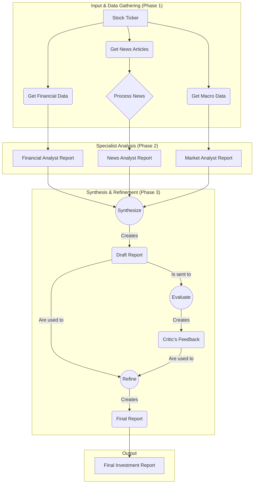

# Quant Apprentice 📈

Quant Apprentice is an autonomous AI agent designed for sophisticated, end-to-end financial analysis. Powered by Google's Gemini 2.5 Pro,
this agent emulates the workflow of a real-world investment research team by planning its analysis, using external data APIs, routing tasks
to specialized sub-agents, and iteratively improving its own conclusions through a self-critique loop.

This project fulfills the requirements of the "Agentic AI" final project by demonstrating three key agentic workflow patterns: 
**Prompt Chaining**, **Task Routing**, and the **Evaluator-Optimizer Loop**.

## Agent Workflow Diagram

This diagram illustrates the flow of data and logic from initial input to the final, refined report.



## 🤖 Agentic Capabilities

The agent is built to demonstrate four core autonomous functions:

  * **Planning & Execution**: The agent follows a multi-step plan to gather data from various sources before making a conclusion.
  * **Dynamic Tool Use**: It intelligently uses its "tool belt" of Python modules to connect to external APIs for real-time data, including:
      * **Yahoo Finance** (`yfinance`): For company-specific financial fundamentals.
      * **FRED API** (`fredapi`): For US macroeconomic data and market context.
      * **NewsAPI** (`newsapi-python`): For the latest news impacting a company.
  * **Self-Reflection**: The agent's most advanced feature. It generates a draft analysis and then a separate "critic" agent evaluates it for bias, gaps, and weaknesses.
  * **Learning (Memory)**: The system is designed to save its final, refined reports to a `memory/` directory, allowing it to reference past analyses in future runs.

## ⚙️ Agentic Workflow Patterns

The agent's intelligence is structured around three distinct, required workflow patterns:

### 1\. Prompt Chaining: News Analysis

A sequential pipeline that transforms raw news articles into structured, actionable insights.
**Workflow**: `Fetch Article` → `Analyze Sentiment` → `Extract Key Takeaways` → `Generate Summary`

### 2\. Task Routing: Specialist Analysts

A "dispatcher" model that directs different types of data to the correct specialist agent for focused analysis. Each specialist is a highly-tuned prompt.

  * **Quantitative Analyst**: Analyzes financial metrics from Yahoo Finance.
  * **News Analyst**: Interprets the short-term impact of the news analysis.
  * **Macroeconomic Analyst**: Provides market context from FRED data.

### 3\. Evaluator-Optimizer Loop: Self-Critique

A cyclical process for quality control and refinement, which is the core of the agent's self-reflection capability.
**Workflow**:

1.  **Synthesize**: A "Chief Strategist" agent combines the specialist reports into a draft investment thesis.
2.  **Evaluate**: A "Risk Manager" agent critiques the draft, providing constructive feedback.
3.  **Refine**: The Strategist agent rewrites the report, incorporating the feedback to produce a more robust final version.

## 🛠️ Technology Stack

  * **AI Engine**: Google Gemini 2.5 Pro
  * **Core Libraries**: `google-generativeai`, `yfinance`, `fredapi`, `newsapi-python`
  * **Language**: Python 3.12+
  * **Environment**: Jupyter Notebook
  * **Utilities**: `python-dotenv`, `pandas`

## 📁 Project Structure

The project is organized into a modular structure to separate concerns and improve readability.

```bash
Quant-Apprentice/
├── quant_apprentice.ipynb    # The final, clean demonstration notebook.
├── test_main.py              # The development and testing script.
├── requirements.txt
├── .env
├── README.md
│
├── tools/                    # Modules for fetching external data.
│   ├── financial_data_fetcher.py
│   └── news_fetcher.py
│
├── workflows/                # Modules for agentic patterns.
│   ├── news_analysis_chain.py
│   ├── specialist_router.py
│   └── report_evaluator.py
│
└── memory/                   # Directory where the agent saves its output.
```

## 🚀 Getting Started

### Prerequisites

  * Python 3.12 or higher
  * Git

### 1. Clone the Repository

```bash
git clone https://github.com/your_username/Quant-Apprentice.git
cd Quant-Apprentice
```

### 2. Create a Conda Environment

```bash
# For macOS/Linux


```

### 3. Install Dependencies

```bash
pip install -r requirements.txt
```

### 4. Set Up API Keys

Create a file named `.env` in the root of the project and add your API keys:

```bash
# .env file
GOOGLE_API_KEY="GEMINI_API_KEY"
FRED_API_KEY="FRED_API_KEY" (free)
NEWS_API_KEY="NEWSAPI_ORG_KEY" (free)
```

### 5. Run the Agent

Open the `quant_apprentice.ipynb` notebook and run the cells to see the agent perform its full, end-to-end analysis.

### 5. Files and content

- File: tools/financial_data_fetcher.py

  Purpose: Fetches stock fundamentals and macroeconomic data.
  
  Functions It Contains: 
  - get_stock_fundamentals(ticker_symbol: str)
  - get_macro_economic_data(api_key: str)

- File: tools/news_fetcher.py
  Purpose: Fetches news articles for a company.
  
  Function It Contains:
  - get_company_news(company_name: str, api_key: str)

- File: workflows/news_analysis_chain.py
  Purpose: Implements our first workflow (Prompt Chaining) to analyze a single article.

  Function It Contains:
  - analyze_article_chain(article_content: str, llm)

- File: workflows/specialist_router.py
  Purpose: Implements our second workflow (Routing) to send data to specialist prompts.

  Function It Contains:

  - route_and_execute_task(task_type: str, data: dict, llm)
