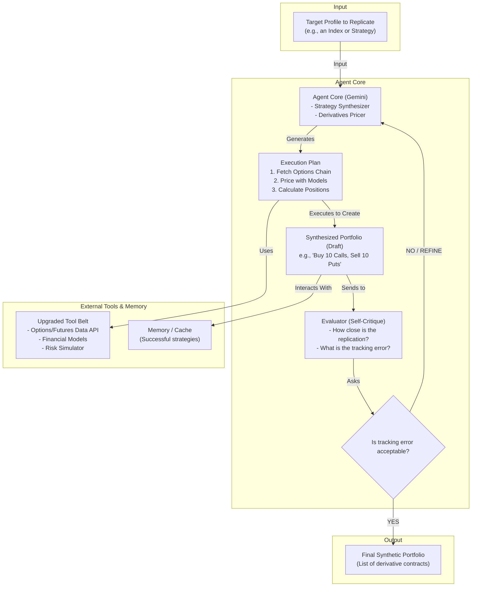

# Quant Apprentice 📈

Quant Apprentice is an autonomous AI agent for advanced financial research, powered by Google's Gemini family of models. 
This project demonstrates how an agentic system can intelligently plan research, use external tools and APIs, critique its own findings, 
and provide motivated investment analysis on publicly traded companies.

The entire project is designed to run seamlessly in a Google Colab environment, leveraging modern agentic AI patterns 
like prompt chaining, task routing, and self-refinement loops.

## 🤖 Agent Functions & Capabilities

The core of Quant Apprentice is an autonomous agent built to replicate and automate the workflow 
of a human financial analyst. Its primary capabilities include:

* **Plan Generation**: The agent dynamically creates a multi-step research plan when given a stock symbol
  (e.g., `GOOGL`, `TSLA`). It outlines the necessary information, from quantitative financial data to qualitative news sentiment.
* **Dynamic Tool Use**: It intelligently selects and utilizes external APIs to gather data. This includes fetching price history
  from **Yahoo Finance**, company news from **NewsAPI.org**, and macroeconomic data from the **FRED API**.
* **Self-Reflection**: After generating an initial analysis, the agent critically assesses its own output. It identifies gaps in 
  its reasoning, potential biases, or areas that require deeper investigation before reaching a conclusion.
* **Learning & Adaptation**: The agent maintains a simple memory to learn from its operations. This allows it to refine its 
  strategies over time, noting which data sources were most useful for specific types of analysis.

## ⚙️ Agentic Workflow Patterns

Quant Apprentice implements three key workflow patterns to achieve its complex, end-to-end analysis capabilities.

### 1. Sequential Prompt Chaining

This pattern is used for structured data processing, especially for news analysis. The agent executes a 
series of dependent tasks to transform raw news articles into actionable insights.

**Workflow Example:** `Ingest Raw News → Preprocess Text → Classify Market Sentiment → Extract Key Financial Entities → Generate Concise Summary`

### 2. Task Routing

To handle diverse types of information, the main agent acts as a dispatcher, routing tasks to 
specialized sub-agents. Each sub-agent is an expert fine-tuned for a specific domain.

* **Earnings Analyzer**: Focuses on parsing quarterly earnings reports and financial statements (Revenue, Net Income, EPS).
* **News Analyzer**: Specializes in sentiment analysis, event detection, and summarization of market-moving news.
* **Market Analyzer**: Analyzes quantitative market data, including price action, trading volume, and key technical indicators.

### 3. Evaluator–Optimizer Loop

This is the agent's self-improvement mechanism. It allows the system to iteratively refine the quality of its financial 
analysis through a feedback cycle.

**Workflow:** `Generate Initial Analysis → Evaluate Output Against Quality Rubric → Generate Constructive Feedback → Refine Analysis Using Feedback`

## 🛠️ Technology Stack

* **Core Engine**: Google Gemini Pro
* **Development Environment**: Google Colab
* **Key Libraries**:
  * `google-generativeai`
  * `langchain` or a similar agent framework
  * `yfinance`
  * `pandas`
  * `requests`
* **Data & APIs**:
  * Yahoo Finance (Stock prices, financials)
  * NewsAPI.org (Financial news)
  * FRED API (Economic data)

